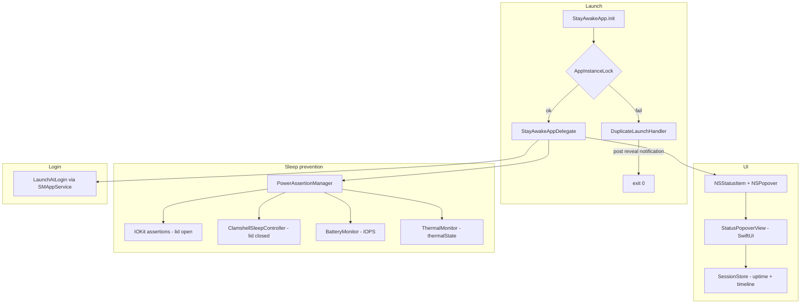

# Architecture

How StayAwake works — for future-me so we don't re-break it.

## Overview

StayAwake is a native Swift/AppKit menu bar app (macOS 13+). SwiftUI provides the `@main` entry point; all visible UI is AppKit `NSStatusItem` + `NSMenu`.



## File map

| File | Role |
|---|---|
| [`StayAwakeApp.swift`](../StayAwake/StayAwakeApp.swift) | `@main` entry, acquires instance lock, dummy SwiftUI `Settings` scene |
| [`StayAwakeAppDelegate.swift`](../StayAwake/StayAwakeAppDelegate.swift) | `NSStatusItem`, popover toggle, icon updates, reveal-on-reopen |
| [`StatusPopoverView.swift`](../StayAwake/StatusPopoverView.swift) | SwiftUI popover: uptime stats, 24h timeline, keep-awake toggles |
| [`SessionStore.swift`](../StayAwake/SessionStore.swift) | Boot/wake clocks, sleep/wake observers, `pmset` seed, event persistence |
| [`PowerLogParser.swift`](../StayAwake/PowerLogParser.swift) | Parse `pmset -g log` into sleep/wake events |
| [`DurationFormatter.swift`](../StayAwake/DurationFormatter.swift) | Human-readable duration strings (`2d 4h 12m`) |
| [`DuplicateLaunchHandler.swift`](../StayAwake/DuplicateLaunchHandler.swift) | Second launch → post reveal notification, activate running instance, exit |
| [`AppInstanceLock.swift`](../StayAwake/AppInstanceLock.swift) | `flock` single-instance lock in `~/Library/Caches/StayAwake/stayawake.lock` |
| [`PowerAssertionManager.swift`](../StayAwake/PowerAssertionManager.swift) | Coordinates lid-open IOKit assertions, lid-closed clamshell controller, battery cutoff, and thermal cutoff |
| [`BatteryMonitor.swift`](../StayAwake/BatteryMonitor.swift) | IOKit Power Sources: AC vs battery, remaining percent, change notifications (publish only on real change) |
| [`LidStateMonitor.swift`](../StayAwake/LidStateMonitor.swift) | Lid open/closed via IOKit clamshell registry, `kIOPMMessageClamshellStateChange`, built-in display fallback, and 10s poll (publish only on real change) |
| [`ThermalMonitor.swift`](../StayAwake/ThermalMonitor.swift) | `ProcessInfo.thermalState` plus battery VirtualTemperature for the popover |
| [`BatteryCutoffAlert.swift`](../StayAwake/BatteryCutoffAlert.swift) | Low-battery warning dialog (Sleep Now / Keep Going) for lid-open cutoff |
| [`ThermalSleepAlert.swift`](../StayAwake/ThermalSleepAlert.swift) | After-wake dialog explaining the Mac slept because it got too hot |
| [`ClamshellSleepController.swift`](../StayAwake/ClamshellSleepController.swift) | Kernel clamshell override via `AppleClamshellCausesSleep` |
| [`LaunchAtLogin.swift`](../StayAwake/LaunchAtLogin.swift) | `SMAppService.mainApp` register/unregister |
| [`ToggleLogger.swift`](../StayAwake/ToggleLogger.swift) | Append-only log at `~/Library/Logs/StayAwake.log` |
| [`Info.plist`](../StayAwake/Info.plist) | `LSUIElement = true` (menu bar agent, no Dock) |

Scripts:

| File | Role |
|---|---|
| [`scripts/install.sh`](../scripts/install.sh) | Build, fix AppIcon.icns, kill old copy, install to `/Applications`, launch |
| [`scripts/lid-test.sh`](../scripts/lid-test.sh) | Before/after snapshots for lid-closed testing |
| [`scripts/generate-app-icon.swift`](../scripts/generate-app-icon.swift) | Procedural coffee cup PNGs for the app icon |

## Launch flow

1. **`StayAwakeApp.init`** calls `AppInstanceLock.acquire()`.
2. If lock fails → **`DuplicateLaunchHandler.handleAlreadyRunning()`**:
   - Posts `com.stayawake.app.reveal` on `DistributedNotificationCenter`
   - Activates the running instance
   - Exits immediately (no alert)
3. If lock succeeds → app runs normally.
4. **`StayAwakeAppDelegate.applicationDidFinishLaunching`** creates the status item and menu.
5. On **`applicationShouldHandleReopen`** or reveal notification → `revealStatusItem()` sets `isVisible = true` and shows the popover.

## Menu bar UI

Implemented in `StayAwakeAppDelegate` with AppKit status item + `NSPopover` hosting SwiftUI, not SwiftUI `MenuBarExtra`.

**Design decisions (do not revert lightly):**

| Decision | Why |
|---|---|
| `NSStatusItem` instead of `MenuBarExtra` | SwiftUI extra could vanish from the menu bar; activation-policy flips made it worse |
| `NSPopover` instead of `NSMenu` | Room for uptime stats and a 24h timeline without cramming into menu rows |
| `LSUIElement` stays `true` | Menu bar only — no Dock clutter |
| Reveal notification on duplicate launch | Clicking the app in Applications must open the popover when already running |
| `statusItem.behavior = []` (macOS 14+) | Prevents dragging the icon off the bar into invisible limbo |
| `autosaveName = "StayAwakeStatusItem"` | Lets macOS persist position; paired with explicit pin on launch |
| Pin `NSStatusItem Preferred Position` to 0 on every launch | Keeps the cup at the far-right edge (away from the notch on crowded bars) |
| `[menubar]` launch log | Records item frame vs notch range for debugging; no user-facing alert |
| `isVisible = true` on every launch | Belt-and-suspenders against hidden state |
| Live 1s timer only while popover is open | Avoids background timer when panel is closed |

Icon: SF Symbol `cup.and.saucer` (outline) or `cup.and.saucer.fill` (when either keep-awake toggle is on).

### Popover contents

`StatusPopoverView` shows:

1. **Up since reboot** — wall clock since `kern.boottime` (sleep does not reset)
2. **Awake since sleep** — wall clock since last full `Wake` event (or boot if none)
3. **Last 24 hours** — horizontal bar of awake vs asleep segments
4. Heat (Nominal / Fair / Serious / Critical) and approximate temperature
5. Keep Awake toggles, **Sleep when too hot**, **Sleep at battery** cutoff, Start at Login, Quit

## Uptime and sleep tracking

`SessionStore` maintains two distinct clocks:

| Clock | Source | Resets on sleep? |
|---|---|---|
| Up since reboot | `sysctl kern.boottime` | No |
| Awake since sleep | Latest `Wake` event since boot | Yes |

Event sources:

- **Seed on launch:** filtered `pmset -g log | grep | tail` parsed by `PowerLogParser` (~3s vs full 50k-line dump)
- **Last-wake fallback:** quick `grep Wake | tail -1` on init so "Awake since sleep" is correct before full seed completes
- **Retry:** if events are still empty when the popover opens, seed runs again
- **Persistence guard:** empty seed results do not overwrite a non-empty `events.json`
- **Live while running:** `NSWorkspace.willSleepNotification`, `didWakeNotification`, `willPowerOffNotification`
- **Persistence:** `~/Library/Application Support/StayAwake/events.json`

DarkWake counts as asleep (machine is not fully awake). Display-only sleep is ignored.

Timeline segments are rebuilt from merged events over a rolling 24-hour window.

## Sleep prevention

### Lid open

`PowerAssertionManager` creates IOKit power assertions when **Keep Awake (Lid Open)** is enabled:

- `kIOPMAssertionTypePreventUserIdleSystemSleep`
- `kIOPMAssertionTypePreventUserIdleDisplaySleep`

Released when toggled off or on quit.

### Lid closed (clamshell override)

When **Keep Awake (Lid Closed)** is enabled, `ClamshellSleepController`:

1. Calls `IOConnectCallScalarMethod` with selector `kPMSetClamshellSleepState` (12) to set `AppleClamshellCausesSleep = No`
2. Creates an idle system sleep assertion
3. Runs a 10-second heartbeat that re-applies only if macOS flipped `AppleClamshellCausesSleep` back to Yes
4. Re-applies on wake from sleep (`NSWorkspace.didWakeNotification`)
5. `setOverrideEnabled` is idempotent — already-on / already-off is a no-op (avoids a main-thread IOKit storm)

On disable/quit, restores clamshell sleep unless "official clamshell mode" is active (external display + AC power).

**Caveats:**
- Most reliable on **AC power**; battery may still sleep
- Runs the machine hot with lid closed — intentional tradeoff

### Battery sleep cutoff

`BatteryMonitor` reads battery level; `LidStateMonitor` reads lid open/closed. When **Sleep at battery** is set (5%, 10%, or 20%) and remaining percent hits the floor on battery power:

| Lid state | Keep-awake mode | Behavior |
|---|---|---|
| Closed | Lid Closed on | **Silent sleep** — suspend keep-awake, 1.5s clamshell handoff, then `pmset sleepnow`; persistent retry with backoff if sleep never starts |
| Open | Lid Open on | **Warning dialog** — Sleep Now / Keep Going (30 min snooze) |
| Closed + both on | Both | Silent path wins |
| Open + both on | Both | Dialog path |

- On **AC power**, cutoff never fires.
- After wake on battery with lid **closed**, silent cutoff may re-fire. With lid **open**, no auto-resleep loop (fixes flicker).
- UI: **Sleep at battery** picker lives under **Keep Awake (Lid Closed)**.

UserDefaults keys: `stayawake.batterySleepThreshold` (`0` = off), `stayawake.batteryCutoffSnoozeUntil` (Unix timestamp).

### Thermal sleep cutoff

`ThermalMonitor` reads `ProcessInfo.thermalState` (notification + 15s poll) and optional `AppleSmartBattery` temps. When **Sleep when too hot** is on (default), thermal sleep runs **only with the lid closed**:

- **Lid open:** no thermal sleep, no heat alert
- **Lid closed:** **Serious** or **Critical** immediately, or **Fair** only if internal sensors read ~140°F (~20% above the prior Fair floor)

1. Suspend keep-awake
2. Persist `stayawake.thermalSleepReason` and `stayawake.thermalSleepLidClosed`
3. Silent `pmset sleepnow` (10s debounce) — no dialog in a backpack
4. On wake (or next launch), show “Your computer was put to sleep because it got too hot.” only if the sleep was lid-closed

Nominal never sleeps. Lid-closed Fair uses a higher internal temperature floor (~140°F). Fan RPM is not used (no public API).

Monitors must only publish when values actually change. Evaluating cutoff on every IOPS tick + re-applying clamshell override previously pinned StayAwake at ~99% CPU.

## Persistence

UserDefaults keys (domain `com.stayawake.app`):

| Key | Meaning |
|---|---|
| `stayawake.lidOpenAwake` | Keep Awake (Lid Open) |
| `stayawake.lidClosedAwake` | Keep Awake (Lid Closed) |
| `stayawake.batterySleepThreshold` | Sleep at battery floor (`0`, `5`, `10`, or `20`) |
| `stayawake.batteryCutoffSnoozeUntil` | Unix timestamp — lid-open cutoff snoozed until this time |
| `stayawake.thermalSleepEnabled` | Sleep when too hot (`true` when unset) |
| `stayawake.thermalSleepReason` | Pending after-wake heat alert (`fair` / `serious` / `critical`) |
| `stayawake.thermalSleepAt` | Unix timestamp of last thermal sleep |
| `stayawake.thermalSleepLidClosed` | `true` when thermal sleep was requested with lid closed (gates after-wake alert) |

`PowerAssertionManager` syncs from UserDefaults every 2 seconds and on `UserDefaults.didChangeNotification` so external changes (e.g. `defaults write`) are picked up. The sync timer does **not** re-evaluate cutoff unless a stored value actually changed.

Start at Login state comes from `SMAppService.mainApp.status`, not UserDefaults.

## Logging

`ToggleLogger` writes ISO8601 timestamps to `~/Library/Logs/StayAwake.log`. Logging is **event-driven** — nothing polls just to write a line. The file is capped at ~2 MB (oldest half trimmed on write).

Crash-survivable state is also written to `~/Library/Logs/StayAwake-last-state.json` before sleep requests and on lid-close. On launch, a `[init] reconcile:` line compares that snapshot to the current boot time and battery.

Example lines:

```
2026-09-14T18:00:00.123Z [init] launch battery=42% ac=false lid=open ...
2026-09-14T18:00:00.456Z [init] reconcile: same boot, last event=didWake
2026-09-14T18:05:00.000Z [lid] lid closed | battery=8% ac=false lid=closed ...
2026-09-14T18:10:00.000Z [power] battery 6% -> 5% | battery=5% ...
2026-09-14T18:10:01.000Z [battery] battery cutoff silent: 5% <= 5%, lidClosed=true
2026-09-14T18:10:01.100Z [sleep] sleepnow spawned (battery cutoff silent) | ...
2026-09-14T18:10:05.000Z [sleep] willSleep | ...
2026-09-14T18:10:21.000Z [sleep] sleepnow issued but still awake (attempt 1/3) | ...
2026-09-14T18:15:00.000Z [battery] cutoff skipped: sleep already requested at 5% | ...
2026-09-14T19:00:00.000Z [init] reconcile: reboot during sleep/wake (last=willSleep, likely kernel panic or hard reset)
```

| Tag | When it fires |
|---|---|
| `init` | Launch, startup toggles, session reconcile |
| `user` / `external` | Toggle changes |
| `lid` | Lid open/close |
| `power` | Battery % change (lid closed or within 5 points of cutoff), AC plug/unplug, clamshell override apply/restore |
| `battery` | Cutoff decisions, snooze, skip reasons |
| `thermal` | Thermal **state** change (not every temp tick), thermal cutoff, after-wake alert |
| `sleep` | `sleepnow` spawn, `willSleep`, `didWake`, screens sleep, verify timeout |
| `menubar` | Status item position vs notch |

Compact snapshots on important lines include battery, AC, lid, toggles, threshold, thermal state/temp, clamshell override, active cutoff, and whether a sleep was already requested.

Open the log from the popover (**Open log**) or `tail -f ~/Library/Logs/StayAwake.log`.

## Build and install

- Xcode project: `StayAwake.xcodeproj`
- Bundle ID: `com.stayawake.app`
- Deployment target: macOS 13.0
- Build number (`CURRENT_PROJECT_VERSION`): 2

`install.sh` builds Release to `build/Build/Products/Release/StayAwake.app`, patches `AppIcon.icns`, copies to `/Applications`, and launches.

## Notifications

| Name | Purpose |
|---|---|
| `com.stayawake.app.reveal` | Duplicate launch tells running instance to show status item and open popover |

Defined in `StayAwakeNotifications.reveal` in `StayAwakeAppDelegate.swift`. Posted via `DistributedNotificationCenter`.
