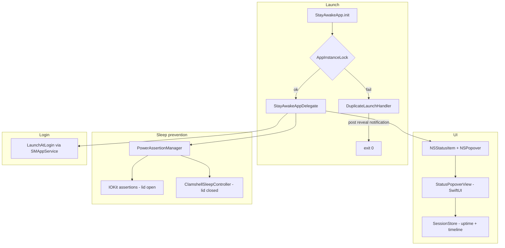

# Architecture

How StayAwake works — for future-me so we don't re-break it.

## Overview

StayAwake is a native Swift/AppKit menu bar app (macOS 13+). SwiftUI provides the `@main` entry point; all visible UI is AppKit `NSStatusItem` + `NSMenu`.



## File map

| File | Role |
|---|---|
| [`StayAwakeApp.swift`](../StayAwake/StayAwakeApp.swift) | `@main` entry, acquires instance lock, dummy SwiftUI `Settings` scene |
| [`StayAwakeAppDelegate.swift`](../StayAwake/StayAwakeAppDelegate.swift) | `NSStatusItem`, popover toggle, icon updates, reveal-on-reopen |
| [`StatusPopoverView.swift`](../StayAwake/StatusPopoverView.swift) | SwiftUI popover: uptime stats, 24h timeline, keep-awake toggles |
| [`SessionStore.swift`](../StayAwake/SessionStore.swift) | Boot/wake clocks, sleep/wake observers, `pmset` seed, event persistence |
| [`PowerLogParser.swift`](../StayAwake/PowerLogParser.swift) | Parse `pmset -g log` into sleep/wake events |
| [`DurationFormatter.swift`](../StayAwake/DurationFormatter.swift) | Human-readable duration strings (`2d 4h 12m`) |
| [`DuplicateLaunchHandler.swift`](../StayAwake/DuplicateLaunchHandler.swift) | Second launch → post reveal notification, activate running instance, exit |
| [`AppInstanceLock.swift`](../StayAwake/AppInstanceLock.swift) | `flock` single-instance lock in `~/Library/Caches/StayAwake/stayawake.lock` |
| [`PowerAssertionManager.swift`](../StayAwake/PowerAssertionManager.swift) | Coordinates lid-open IOKit assertions and lid-closed clamshell controller |
| [`ClamshellSleepController.swift`](../StayAwake/ClamshellSleepController.swift) | Kernel clamshell override via `AppleClamshellCausesSleep` |
| [`LaunchAtLogin.swift`](../StayAwake/LaunchAtLogin.swift) | `SMAppService.mainApp` register/unregister |
| [`ToggleLogger.swift`](../StayAwake/ToggleLogger.swift) | Append-only log at `~/Library/Logs/StayAwake.log` |
| [`Info.plist`](../StayAwake/Info.plist) | `LSUIElement = true` (menu bar agent, no Dock) |

Scripts:

| File | Role |
|---|---|
| [`scripts/install.sh`](../scripts/install.sh) | Build, fix AppIcon.icns, kill old copy, install to `/Applications`, launch |
| [`scripts/lid-test.sh`](../scripts/lid-test.sh) | Before/after snapshots for lid-closed testing |
| [`scripts/generate-app-icon.swift`](../scripts/generate-app-icon.swift) | Procedural coffee cup PNGs for the app icon |

## Launch flow

1. **`StayAwakeApp.init`** calls `AppInstanceLock.acquire()`.
2. If lock fails → **`DuplicateLaunchHandler.handleAlreadyRunning()`**:
   - Posts `com.stayawake.app.reveal` on `DistributedNotificationCenter`
   - Activates the running instance
   - Exits immediately (no alert)
3. If lock succeeds → app runs normally.
4. **`StayAwakeAppDelegate.applicationDidFinishLaunching`** creates the status item and menu.
5. On **`applicationShouldHandleReopen`** or reveal notification → `revealStatusItem()` sets `isVisible = true` and shows the popover.

## Menu bar UI

Implemented in `StayAwakeAppDelegate` with AppKit status item + `NSPopover` hosting SwiftUI, not SwiftUI `MenuBarExtra`.

**Design decisions (do not revert lightly):**

| Decision | Why |
|---|---|
| `NSStatusItem` instead of `MenuBarExtra` | SwiftUI extra could vanish from the menu bar; activation-policy flips made it worse |
| `NSPopover` instead of `NSMenu` | Room for uptime stats and a 24h timeline without cramming into menu rows |
| `LSUIElement` stays `true` | Menu bar only — no Dock clutter |
| Reveal notification on duplicate launch | Clicking the app in Applications must open the popover when already running |
| `statusItem.behavior = []` (macOS 14+) | Prevents dragging the icon off the bar into invisible limbo |
| No autosave name on status item | Autosave can persist a "hidden" state across launches |
| `isVisible = true` on every launch | Belt-and-suspenders against hidden state |
| Live 1s timer only while popover is open | Avoids background timer when panel is closed |

Icon: SF Symbol `cup.and.saucer` (outline) or `cup.and.saucer.fill` (when either keep-awake toggle is on).

### Popover contents

`StatusPopoverView` shows:

1. **Up since reboot** — wall clock since `kern.boottime` (sleep does not reset)
2. **Awake since sleep** — wall clock since last full `Wake` event (or boot if none)
3. **Last 24 hours** — horizontal bar of awake vs asleep segments
4. Keep Awake toggles, Start at Login, Quit

## Uptime and sleep tracking

`SessionStore` maintains two distinct clocks:

| Clock | Source | Resets on sleep? |
|---|---|---|
| Up since reboot | `sysctl kern.boottime` | No |
| Awake since sleep | Latest `Wake` event since boot | Yes |

Event sources:

- **Seed on launch:** `pmset -g log` parsed by `PowerLogParser` (Sleep, Wake, DarkWake, Shutdown, Restart)
- **Live while running:** `NSWorkspace.willSleepNotification`, `didWakeNotification`, `willPowerOffNotification`
- **Persistence:** `~/Library/Application Support/StayAwake/events.json`

DarkWake counts as asleep (machine is not fully awake). Display-only sleep is ignored.

Timeline segments are rebuilt from merged events over a rolling 24-hour window.

## Sleep prevention

### Lid open

`PowerAssertionManager` creates IOKit power assertions when **Keep Awake (Lid Open)** is enabled:

- `kIOPMAssertionTypePreventUserIdleSystemSleep`
- `kIOPMAssertionTypePreventUserIdleDisplaySleep`

Released when toggled off or on quit.

### Lid closed (clamshell override)

When **Keep Awake (Lid Closed)** is enabled, `ClamshellSleepController`:

1. Calls `IOConnectCallScalarMethod` with selector `kPMSetClamshellSleepState` (12) to set `AppleClamshellCausesSleep = No`
2. Creates an idle system sleep assertion
3. Runs a 1-second heartbeat timer to re-apply the override
4. Re-applies on wake from sleep (`NSWorkspace.didWakeNotification`)

On disable/quit, restores clamshell sleep unless "official clamshell mode" is active (external display + AC power).

**Caveats:**
- Most reliable on **AC power**; battery may still sleep
- Runs the machine hot with lid closed — intentional tradeoff

## Persistence

UserDefaults keys (domain `com.stayawake.app`):

| Key | Meaning |
|---|---|
| `stayawake.lidOpenAwake` | Keep Awake (Lid Open) |
| `stayawake.lidClosedAwake` | Keep Awake (Lid Closed) |

`PowerAssertionManager` syncs from UserDefaults every 2 seconds and on `UserDefaults.didChangeNotification` so external changes (e.g. `defaults write`) are picked up.

Start at Login state comes from `SMAppService.mainApp.status`, not UserDefaults.

## Logging

`ToggleLogger` writes ISO8601 timestamps to `~/Library/Logs/StayAwake.log`:

```
2026-09-03T22:15:00.123Z [user] Keep Awake (Lid Open): false -> true
2026-09-03T22:15:00.456Z [init] Keep Awake (Lid Closed): enabled=false
2026-09-03T22:16:00.789Z [external] Start at Login: false -> true
```

Sources: `user`, `init`, `external`.

## Build and install

- Xcode project: `StayAwake.xcodeproj`
- Bundle ID: `com.stayawake.app`
- Deployment target: macOS 13.0
- Build number (`CURRENT_PROJECT_VERSION`): 2

`install.sh` builds Release to `build/Build/Products/Release/StayAwake.app`, patches `AppIcon.icns`, copies to `/Applications`, and launches.

## Notifications

| Name | Purpose |
|---|---|
| `com.stayawake.app.reveal` | Duplicate launch tells running instance to show status item and open popover |

Defined in `StayAwakeNotifications.reveal` in `StayAwakeAppDelegate.swift`. Posted via `DistributedNotificationCenter`.
